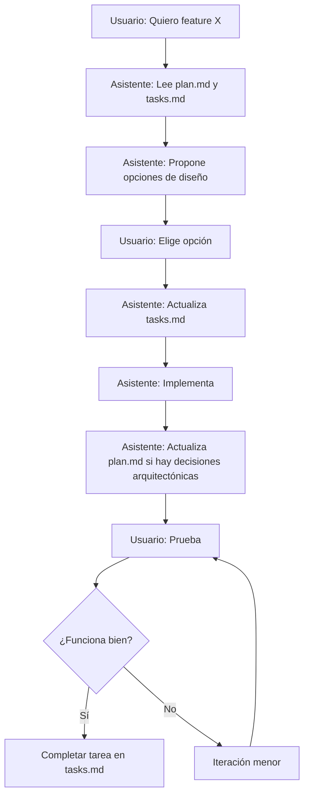
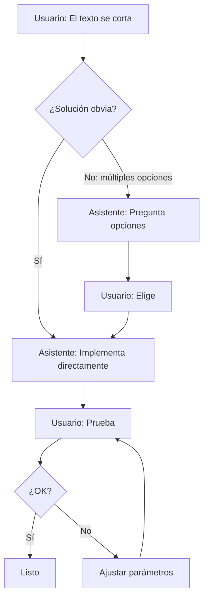

# Guía de Metodología SDD (Specification-Driven Development)

> **Documento vivo:** Esta guía se actualiza continuamente con aprendizajes del proyecto TarotAI.
>
> **Última actualización:** 2026-04-29

---

## 📋 Índice

1. [¿Qué es SDD?](#qué-es-sdd)
2. [Documentos fundamentales](#documentos-fundamentales)
3. [Flujo de trabajo](#flujo-de-trabajo)
4. [Cuándo actualizar los documentos](#cuándo-actualizar-los-documentos)
5. [Comunicación con el asistente](#comunicación-con-el-asistente)
6. [Aprendizajes del proyecto](#aprendizajes-del-proyecto)

---

## ¿Qué es SDD?

**Specification-Driven Development** es una metodología donde:
- Los **documentos de especificación** son la fuente de verdad
- Cada decisión importante se **documenta antes de implementar**
- El código se genera **a partir de las especificaciones**, no al revés

### Beneficios

✅ **Claridad:** Todos (humanos y AI) entienden qué construir
✅ **Trazabilidad:** Cada feature tiene su justificación documentada
✅ **Consistencia:** El asistente siempre trabaja con la misma visión
✅ **Mantenibilidad:** Nuevos desarrolladores/asistentes entienden el "por qué"
✅ **Reducción de retrabajo:** Decisiones claras desde el inicio

---

## Documentos fundamentales

### 1. `docs/requirements/` (estructura modular)
**Qué contiene:** Requisitos funcionales y no funcionales (el QUÉ)

La documentación de requirements está dividida en archivos especializados:
- `index.md` - Resumen ejecutivo y tabla de contenidos
- `funcionales.md` - 10 requisitos funcionales (RF-01 a RF-10)
- `no-funcionales.md` - 5 requisitos no funcionales (RNF-01 a RNF-05)
- `ui-ux.md` - Especificaciones de interfaz y experiencia
- `criterios-aceptacion.md` - 99 criterios de aceptación detallados

```markdown
# Ejemplo de funcionales.md
## RF-01: Realizar tiradas de tarot
El usuario debe poder realizar tiradas con 5 tipos diferentes:
- Simple (1 carta)
- Sí o No (1 carta)
- Presente (3 cartas)
- Tendencia (3 cartas)
- Cruz (5 cartas)
```

**Cuándo actualizar:**
- ✅ Cuando cambian los requerimientos del negocio
- ✅ Cuando se agregan nuevas funcionalidades
- ❌ NO para cambios de implementación (ej: cambiar un color)

**Ventaja de la estructura modular:** El asistente solo lee los archivos necesarios, ahorrando ~70% de tokens.

### 2. `docs/plan/` (estructura modular)
**Qué contiene:** Decisiones técnicas y arquitectura (el CÓMO)

La documentación de plan está dividida en 19 archivos especializados:
- `index.md` - Tabla de contenidos
- `01-arquitectura.md` - MVVM + Clean Architecture
- `02-estandares.md` - Estándares de código (documentación en español)
- `03-estructura-proyecto.md` - Organización de paquetes
- `04-tecnologias.md` - Stack técnico y justificaciones
- ... hasta `17-metricas.md`

```markdown
# Ejemplo de 02-estandares.md
## Estándares de Código

### Documentación en Español
**REQUERIMIENTO OBLIGATORIO:** Todo el código debe estar documentado en español.

**Reglas de documentación:**
- Clases: Comentario con descripción breve
- @property para cada parámetro del constructor
```

**Cuándo actualizar:**
- ✅ Decisiones arquitectónicas (patrón de diseño, librerías)
- ✅ Estándares de código (documentación en español)
- ✅ Trade-offs importantes (por qué elegimos X sobre Y)
- ❌ NO para ajustes menores de UI

**Ventaja de la estructura modular:** El asistente solo lee las secciones relevantes, ahorrando ~80% de tokens.

### 3. `tasks.md`
**Qué contiene:** Lista de tareas específicas por fase

```markdown
# Ejemplo
### Fase 3: Sistema de Tiradas
- [x] Tarea 3.1: Crear modelos de dominio
- [x] Tarea 3.2: Implementar UI de lectura
- [ ] Tarea 3.3: Agregar animaciones
```

**Cuándo actualizar:**
- ✅ Cuando se completa una tarea
- ✅ Cuando se descubren nuevas subtareas
- ✅ Cuando cambian prioridades

### 4. `guia-sdd.md` (este archivo)
**Qué contiene:** Metodología, mejores prácticas, aprendizajes

**Cuándo actualizar:**
- ✅ Cuando aprendemos algo nuevo sobre el flujo
- ✅ Cuando identificamos un patrón que funciona bien
- ✅ Cuando detectamos un anti-patrón a evitar

---

## Flujo de trabajo

### Para FEATURES NUEVAS (ej: Fase 4 - Integración IA)



**Ejemplo real:**
```
Usuario: "Quiero integrar Claude API"

Asistente:
"Veo que plan.md ya define la estructura de API.
Tengo 3 opciones para manejar la API key:

A) BuildConfig (en el APK)
B) Variables de entorno
C) Backend proxy

El plan.md sugiere A para MVP. ¿Procedo con esa opción?"

Usuario: "Sí, adelante"

Asistente: [Implementa, actualiza tasks.md]
```

### Para AJUSTES MENORES (ej: cambiar tamaño de fuente)



**Ejemplo real:**
```
Usuario: "El texto se ve muy grande"
Asistente: [Reduce fontSize de 14sp a 11sp]
Usuario: "Perfecto"
```

### Para DECISIONES AMBIGUAS

**Usar `AskUserQuestion` cuando:**
- Hay múltiples soluciones técnicas válidas
- Hay trade-offs (UX vs performance, simplicidad vs funcionalidad)
- El cambio afecta significativamente la experiencia

**Ejemplo:**
```
Usuario: "Las 3 cartas no entran en pantalla"

Asistente: [Usa AskUserQuestion]
"Tengo 2 opciones:
A) Scroll horizontal - cartas de tamaño fijo
B) Ajustar al ancho - cartas se redimensionan

¿Cuál prefieres?"

Usuario: "La B"
```

---

## Cuándo actualizar los documentos

### Matriz de decisión

| Tipo de cambio | requirements.md | plan.md | tasks.md | Notas |
|----------------|----------------|---------|----------|-------|
| Nueva funcionalidad | ✅ Sí | ✅ Sí | ✅ Sí | Documentar todo |
| Decisión arquitectónica | ❌ No | ✅ Sí | ❌ No | Ej: elegir librería |
| Estándar de código | ❌ No | ✅ Sí | ❌ No | Ej: documentación en español |
| Subtarea descubierta | ❌ No | ❌ No | ✅ Sí | Agregar a fase actual |
| Ajuste UI (color, tamaño) | ❌ No | ❌ No | ❌ No | Solo en commit message |
| Bug fix | ❌ No | ❌ No | ❌ No | Solo en commit message |
| Refactor sin cambio funcional | ❌ No | 🟡 Tal vez | ❌ No | Solo si cambia arquitectura |

### Ejemplos concretos del proyecto

#### ✅ Cambios que SÍ actualizaron documentos

**1. Estándar de documentación en español** → `plan.md`
```markdown
## 2. Estándares de Código
### 2.1 Documentación en Español
Todo el código debe estar documentado en español.
```
**Por qué:** Es una decisión de estándar que afecta todo el código futuro.

#### ❌ Cambios que NO requirieron actualizar documentos

**1. Ajuste de fontSize de 14sp a 11sp**
- **Por qué NO:** Es un detalle de implementación
- **Dónde quedó:** En el commit message y el código

**2. Cambio de horizontalScroll a weight(1f)**
- **Por qué NO:** Es un ajuste de implementación, no cambia la arquitectura
- **Dónde quedó:** En el commit message

**3. LaunchedEffect con Unit vs (spreadType, question)**
- **Por qué NO:** Es un bug fix, no un cambio de diseño
- **Dónde quedó:** En el commit message

#### 🟡 Cambios que PUDIERON documentarse (lección aprendida)

**Layout de cartas (3 opciones probadas)**

**Lo que pasó:**
1. Primera versión: vertical con scroll
2. Segunda versión: horizontal con scroll
3. Versión final: horizontal con weight

**Lo que pudimos documentar en `docs/fase3-completada.md`:**
```markdown
## Decisiones de diseño UI

### Layout de cartas en tiradas
- **Tiradas 3 cartas:** Row con weight(1f)
  - Se ajustan automáticamente al ancho de pantalla
  - Rationale: Se probó scroll horizontal pero se prefirió
    ajuste automático para mejor UX en pantallas pequeñas

### Tipografía
- Títulos: 10sp, Nombres: 11sp, Orientación: 9sp
  - Rationale: Tamaños reducidos para evitar corte de
    texto en cartas pequeñas
```

**Por qué documentar:** Para que futuros cambios entiendan el "por qué" de estas decisiones.

---

## Comunicación con el asistente

### Lo que funciona bien ✅

**1. Feedback directo y visual**
```
✅ "Las 3 cartas salen una abajo de la otra, quiero que vayan una al lado de la otra"
❌ "No me gusta el layout"
```

**2. Mencionar documentos cuando sea relevante**
```
✅ "Según plan.md, esto debería usar MVVM. ¿Estamos cumpliendo eso?"
✅ "Esto debería ser una nueva tarea en tasks.md"
```

**3. Pedir planificación cuando lo necesites**
```
✅ "Antes de implementar, dame opciones de cómo hacer esto"
✅ "Planifica esto y muéstrame el plan antes de codear"
```

### 📊 Formato de respuestas del asistente

**IMPORTANTE**: Todas las respuestas del asistente deben terminar con el reporte de consumo de tokens:

```
---

📊 **Consumo de tokens en esta respuesta:**
- Tokens usados en esta interacción: [cantidad solo de esta pregunta/respuesta]
- Tokens totales acumulados: [total usado en la sesión]
- Tokens restantes: [cantidad] de 200,000
- Porcentaje usado: [%]
```

**Objetivo**: Aprender sobre el consumo de tokens en diferentes tipos de interacciones.

### Comandos útiles

**Para el usuario:**
- `"Dame opciones"` → El asistente propone alternativas antes de implementar
- `"Actualiza [documento]"` → Fuerza actualización de docs
- `"¿Esto debería documentarse?"` → El asistente evalúa qué actualizar
- `"Planifica antes de implementar"` → Modo Copilot (plan → aprobación → código)

**Para el asistente:**
- Usar `AskUserQuestion` cuando hay múltiples opciones válidas
- Leer `plan.md` y `tasks.md` antes de cada fase
- Usar `TodoWrite` para trackear subtareas
- Preguntar decisiones de diseño ANTES de implementar

---

## Aprendizajes del proyecto

### 🎯 Patrón: Iteración controlada

**Situación:** Ajustes de UI que requieren feedback visual

**Enfoque que funciona:**
1. Implementar rápido una primera versión
2. Usuario prueba y da feedback específico
3. Iterar hasta que quede bien
4. **Documentar la decisión final si es significativa**

**Ejemplo:** Layout de cartas (vertical → horizontal scroll → horizontal weight)

**Lección:** Está bien iterar en UI, pero documentar la versión final.

---

### ⚠️ Anti-patrón: Implementar sin preguntar cuando hay opciones

**Situación:** Feature con múltiples implementaciones válidas

**Lo que pasó:**
- Implementé scroll horizontal sin preguntar
- Usuario probó y prefirió ajuste automático
- Tuvimos que re-implementar

**Lo que debí hacer:**
```
Asistente: "Para las 3 cartas, tengo 2 opciones:
A) Scroll horizontal
B) Ajuste automático al ancho
¿Cuál prefieres?"
```

**Lección:** Cuando hay trade-offs de UX, preguntar ANTES.

---

### 🎯 Patrón: Documentar estándares en plan.md

**Situación:** Requisito de documentación en español

**Lo que hicimos bien:**
1. Usuario identificó que faltaban comentarios
2. Lo agregamos como **requerimiento técnico en plan.md**
3. Ahora es un estándar que se aplica a todo código futuro

**Lección:** Los estándares de código van en `plan.md`, no solo en "buenas intenciones".

---

### 🎯 Patrón: TodoWrite para visibilidad

**Situación:** Múltiples subtareas en una sesión

**Lo que funciona:**
```
TodoWrite([
  {content: "Ajustar layout 3 cartas", status: "in_progress"},
  {content: "Arreglar layout cruz", status: "pending"},
  {content: "Reducir tipografía", status: "pending"}
])
```

**Beneficios:**
- Usuario ve el progreso en tiempo real
- No se olvidan tareas
- Queda registro de qué se hizo

**Lección:** Usar TodoWrite proactivamente, no solo cuando hay muchas tareas.

---

### ⚠️ Anti-patrón: Asumir que "obvio" es obvio

**Situación:** Decisión que parece obvia técnicamente pero tiene implicaciones UX

**Ejemplo:**
- Para mí (asistente): "Scroll es la solución estándar cuando no cabe"
- Para usuario: "Prefiero que se ajuste, no quiero scroll"

**Lección:** Lo que es "obvio" técnicamente puede no ser lo deseado en UX.

---

## Checklist: ¿Debo actualizar documentos?

Usa este checklist después de cada cambio importante:

```markdown
[ ] ¿Cambiaron los requerimientos funcionales?
    → Sí: Actualizar requirements.md

[ ] ¿Se tomó una decisión arquitectónica?
    → Sí: Actualizar plan.md (sección correspondiente)

[ ] ¿Se definió un nuevo estándar de código?
    → Sí: Actualizar plan.md (Estándares de Código)

[ ] ¿Se descubrieron nuevas subtareas?
    → Sí: Actualizar tasks.md (fase actual)

[ ] ¿Se completó una tarea?
    → Sí: Marcar como [x] en tasks.md

[ ] ¿Se aprendió algo sobre metodología?
    → Sí: Actualizar guia-sdd.md (esta guía)

[ ] ¿Fue solo un ajuste de implementación (UI, bug fix)?
    → No actualizar docs, solo commit message descriptivo
```

---

## Evolución de la guía

### Versión 1.0 (2026-04-29)
- ✅ Creación inicial del documento
- ✅ Documentación de flujos de trabajo
- ✅ Matriz de decisión para actualizar docs
- ✅ Aprendizajes de Fases 2 y 3

### Próximas adiciones
- [ ] Mejores prácticas para commits
- [ ] Cómo manejar cambios de requerimientos mid-fase
- [ ] Estrategias para refactoring grande
- [ ] Ejemplos de cada tipo de documento al final de fase

---

## Recursos adicionales

**Documentación modular:**
- `docs/requirements/` - Requisitos del proyecto (5 archivos)
  - [index.md](requirements/index.md) - Resumen ejecutivo
  - [funcionales.md](requirements/funcionales.md) - RF-01 a RF-10
  - [no-funcionales.md](requirements/no-funcionales.md) - RNF-01 a RNF-05
  - [ui-ux.md](requirements/ui-ux.md) - Especificaciones de interfaz
  - [criterios-aceptacion.md](requirements/criterios-aceptacion.md) - 99 criterios
- `docs/plan/` - Plan técnico y arquitectura (19 archivos)
  - [index.md](plan/index.md) - Tabla de contenidos
  - [01-arquitectura.md](plan/01-arquitectura.md) - MVVM + Clean
  - [02-estandares.md](plan/02-estandares.md) - Estándares de código
  - ... 16 archivos más
- [tasks.md](tasks.md) - Lista de tareas por fase
- `docs/fases/` - Documentación de fases completadas
  - [fase3-completada.md](fases/fase3-completada.md) - Sistema de Tiradas

**Guías metodológicas:**
- [guia-sdd.md](guia-sdd.md) - Esta guía de metodología SDD
- [ahorroTokens.md](ahorroTokens.md) - Guía de optimización de tokens (genérica)

---

**Fin de la guía SDD**
